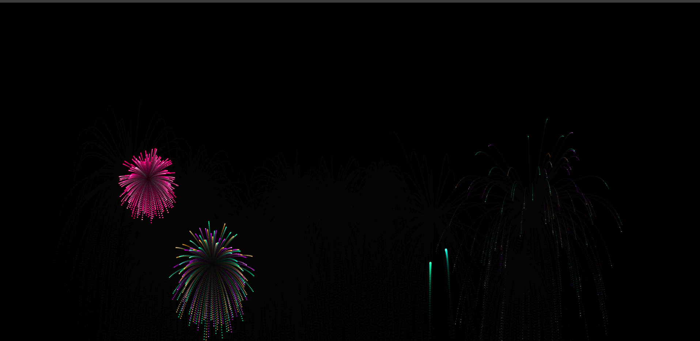

# Shiv's Dynamic Theme Chrome Extension

## Overview
Shiv's Dynamic Theme is a Chrome extension that transforms your new tab page into a visually stunning and interactive experience. It features dynamic background images that change every 30 seconds, customizable shortcuts arranged in a circular layout, and a festive fireworks animation that activates after 35 seconds of inactivity. The extension is designed to be lightweight, responsive, and user-friendly, enhancing productivity while adding a touch of personalization and fun.

This extension overrides the default Chrome new tab page (`chrome://newtab`) with a custom HTML page.

## Features
- **Dynamic Backgrounds**: Automatically cycles through 20 high-quality background images (background1.jpg to background20.jpg) every 30 seconds, ensuring no immediate repeats for a fresh look.
- **Customizable Shortcuts**: Add, edit, and delete shortcuts to your favorite websites. Shortcuts are displayed in a responsive circular arrangement around a central "+" icon. Right-click a shortcut to delete it.
- **Automatic Icon Fetching**: When adding a shortcut, the extension automatically fetches favicons for popular sites (e.g., YouTube, Google, Facebook) or uses Google's favicon service as a fallback. You can also upload custom icons.
- **Inactivity Mode**: After 35 seconds of no mouse/keyboard activity, shortcuts fade out, and a Diwali-inspired fireworks animation begins, creating a relaxing screensaver-like effect. Activity resumes the interactive mode instantly.
- **Responsive Design**: Adapts to different screen sizes, including mobile and tablet views, with adjusted element sizes and layouts.
- **Local Storage**: All shortcuts and icons are stored locally in your browser's `localStorage` for privacy and persistence across sessions.
- **Fireworks Animation**: A canvas-based particle system simulating various firework styles (chrysanthemum, peony, willow, ring) with randomized colors and explosions.

## Screenshots
- 
- 
- 

## Installation
### From Source (for Development)
1. Clone this repository:
   ```
   git clone https://github.com/ShivaKrishnaReddyBurra/Custom-crome-extension.git
   ```
2. Open Chrome and navigate to `chrome://extensions/`.
3. Enable "Developer mode" in the top right.
4. Click "Load unpacked" and select the folder containing the extension files.
5. The extension will now override your new tab page.

<!-- ### From Chrome Web Store
*(Once published, add the link here:)*
- Install from the [Chrome Web Store](https://chromewebstore.google.com/detail/extension-id). -->

<!-- **Note**: Ensure the background images (background1.jpg to background20.jpg) are placed in the extension's root directory. These are not included in the repository for size reasons—source your own images or download placeholders. -->

## Usage
1. Open a new tab in Chrome.
2. Click the central "+" icon to add a shortcut.
3. Enter the shortcut name and URL. The icon will auto-populate, or upload a custom one.
4. Shortcuts appear in a circle. Click to navigate, right-click to delete.
5. Stay inactive for 35 seconds to trigger fireworks (move mouse or press a key to return to normal mode).

## Technical Details
- **Manifest Version**: 3
- **Files**:
  - `manifest.json`: Defines the extension structure, overrides, and web-accessible resources.
  - `newtab.html`: The main HTML for the new tab page, including styles and modal for adding shortcuts.
  - `script.js`: Handles logic for backgrounds, shortcuts, animations, and events.
- **Dependencies**: None (pure JavaScript, HTML, CSS, and Canvas API).
- **Storage**: Uses `localStorage` to save shortcuts as JSON. No data is sent to servers.
- **Permissions**: No special permissions required—safe and minimal.

## Privacy and Security
- No personal data is collected or transmitted.
- All operations are local to your browser.
- Shortcuts and icons are stored in `localStorage`, which is isolated per extension.

